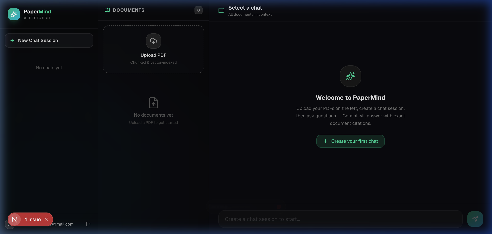
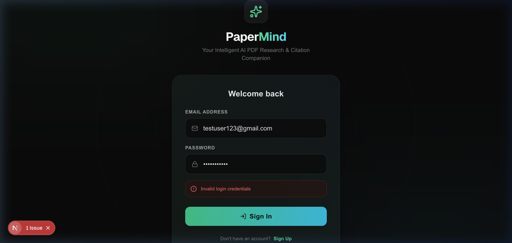

# 📑 PaperMind — AI PDF Research Assistant

PaperMind is a premium, production-ready AI PDF Research Assistant. It allows researchers and professionals to upload multiple PDF documents, automatically index and chunk their contents into a vector database, scope their searches, and chat with an interactive AI. 

The AI responds with **precise, clickable inline citations** linking directly to the cited page and text snippet within a slide-over document viewer.

---

## 🔗 Deployed Application Links

* **Live Frontend Web App (Vercel)**: [https://your-frontend-domain.vercel.app](https://your-frontend-domain.vercel.app)
* **Live Backend REST API (Render)**: [https://your-backend-api.onrender.com](https://your-backend-api.onrender.com)

---

## 📸 Application Showcases

### 1. Research Cockpit (Dashboard)


### 2. Premium Authentication Portal


---

## 🚀 Key Engineering & Architecture Highlights

### 1. High-Performance RAG Pipeline
```
[ User PDF ] ──► [ PyMuPDF Extraction ] ──► [ Sliding-Window Chunking ] ──► [ Sentence-Transformers ] ──► [ pgvector in Supabase ]
                                                                                                                   │
                                                                                                                   ▼
[ User Question ] ◄── [ Grounded Citations ] ◄── [ Gemini 2.5 Flash ] ◄── [ Similar Contexts ] ◄── [ Semantic Match ]
```

* **Sliding Window Chunking**: Text is split into logical overlaps using sentence-boundary alignment to ensure semantic context isn't lost mid-sentence.
* **Vector Similarity Matching**: Employs the `pgvector` extension in PostgreSQL (Supabase) to execute cosine similarity matching on 384-dimensional embeddings generated by `all-MiniLM-L6-v2`.
* **Gemini 2.5 Flash RAG**: Integrates the brand-new `google-genai` SDK. The model is structured via strict system instructions to base answers *strictly* on retrieved contexts and output precise citation mapping metadata.

### 2. Production Security & Auth Architecture
* **Supabase REST Verification**: Solved default Supabase JWT algorithm drifts (HS256/ES256/RS256) by performing direct server-side token checks via Supabase's `/auth/v1/user` endpoint. This approach is highly robust and future-proof.
* **Guaranteed Fresh Tokens**: The Next.js client fetches a fresh token directly from the active Supabase session before every API request, avoiding stale auth states.

### 3. Sleek UI/UX (Tailwind v4 & React 19)
* **Interactive Citations**: Inline brackets `[1]` are dynamically parsed into clickable interactive buttons. Clicking a badge opens a slide-over panel displaying the exact cited PDF page and text snippet.
* **Robust UI Interactions**: Replaced blocked native browser `confirm()` calls with elegant inline confirmations ("Delete? **Yes** / No") inside document lists and chat sidebars.
* **Inline Renaming**: Double-click or select the Pencil edit icon next to any chat to rename it instantly in-place.

---

## 🛠️ Tech Stack

* **Frontend**: Next.js 16 (App Router), React 19, TypeScript, Tailwind CSS v4, Lucide React icons.
* **Backend**: FastAPI (Python 3.11+), PyMuPDF (PDF parser), Sentence Transformers (embedding engine), Uvicorn.
* **Database & Storage**: PostgreSQL with `pgvector` (via Supabase), Supabase Storage.
* **LLM**: Gemini API (via the new `google-genai` SDK).

---

## 📦 Local Setup & Installation

### 1. Prerequisites
* Python 3.11 or higher installed.
* Node.js 18 or higher installed.
* A Supabase project with `pgvector` enabled and database tables initialized.
* A Google Gemini API Key.

### 2. Backend Setup
1. Navigate to the backend directory:
   ```bash
   cd backend
   ```
2. Create and activate a virtual environment:
   ```bash
   python3 -m venv .venv
   source .venv/bin/activate
   ```
3. Install dependencies:
   ```bash
   pip install -r requirements.txt
   ```
4. Create a `.env` file in the `backend/` folder:
   ```env
   DATABASE_URL="postgresql://postgres:[PASSWORD]@[HOST]:[PORT]/postgres"
   SUPABASE_URL="https://[PROJECT-ID].supabase.co"
   SUPABASE_ANON_KEY="your-anon-key"
   SUPABASE_JWT_SECRET="your-jwt-secret"
   GEMINI_API_KEY="your-gemini-api-key"
   CORS_ORIGINS="http://localhost:3000"
   ```
5. Run the server:
   ```bash
   python -m app.main
   ```
   The backend will start at `http://localhost:8000`.

### 3. Frontend Setup
1. Navigate to the frontend directory:
   ```bash
   cd ../frontend
   ```
2. Install Node packages:
   ```bash
   npm install
   ```
3. Create a `.env.local` file in the `frontend/` folder:
   ```env
   NEXT_PUBLIC_SUPABASE_URL="https://[PROJECT-ID].supabase.co"
   NEXT_PUBLIC_SUPABASE_ANON_KEY="your-anon-key"
   NEXT_PUBLIC_API_URL="http://localhost:8000"
   ```
4. Start the Next.js dev server:
   ```bash
   npm run dev
   ```
   The frontend will start at `http://localhost:3000`.

---

